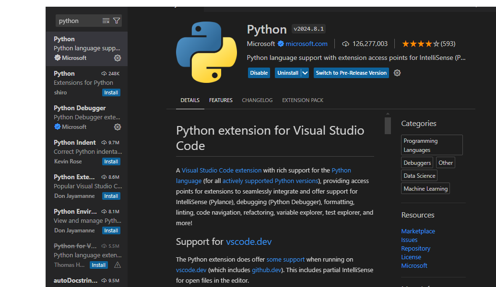
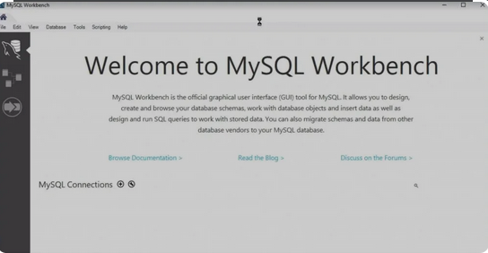

# Dev_Setup
Setup Development Environment

#Assignment: Setting Up Your Developer Environment

#Objective:
This assignment aims to familiarize you with the tools and configurations necessary to set up an efficient developer environment for software engineering projects. Completing this assignment will give you the skills required to set up a robust and productive workspace conducive to coding, debugging, version control, and collaboration.

#Tasks:

1. Select Your Operating System (OS):
   Choose an operating system that best suits your preferences and project requirements. Download and Install Windows 11. https://www.microsoft.com/software-download/windows11

     I started with installing windows 11 on my laptop.
     I used a bootable USB drive.
     I downloaded the windows 11 ISO file from the microsoft
     I booted the laptop from the USB drive and installed windows 11.
     To confirm windows that windows were installed, I checked the system properties by right-clicking on the start button. Selected the system.
     Attached here is the screenshot, labeled as windows 11.png
     

     Developer System Installation

## Steps and Screenshots of Windows 11 Installation.
Downloading Windows 11

1.  Create a Bootable USB Drive 
    First I Downloaded the Windows 11 ISO file from Microsoft website.
    I used the Rufus software to create a bootable USB drive.

    
2. Prepare Your System:

    Backed up my important data.
    Disconnected any unnecessary peripherals.
    Ensured the system met the hardware requirements.

3. Boot from the Bootable Media:

    Inserted the USB drive into the system and restarted.
    Access the boot menu by pressing the appropriate key (usually F1, F2, F10, or Del).
    Selected the USB drive as the boot device.

4. Begin the Installation:

    The Windows 11 Setup Wizard appeared.
    I selected the language, time, and currency preferences.
    Clicked on "Install Now".

5. Choose Your Installation Type:

    Selected "Custom: Install Windows 11 only (advanced)" because I wanted to perform a clean installation and remove all existing data.

6. Select the Drive and Partition:

    I chose the drive where I wanted to install Windows 11.
    #If necessary, create or format a new partition.

7. Install Windows 11:

    The installation process began. Took some time depending on the system and hardware.
    Once the installation was complete, the system restarted and took me to the Windows 11 desktop.

8. Perform Post-Installation Setup:

    I followed the on-screen prompts and completed the post-installation setup.
    I did set up my user account, configured the settings, and installed any necessary drivers or updates.
 

2. Install a Text Editor or Integrated Development Environment (IDE):
   Select and install a text editor or IDE suitable for your programming languages and workflow. Download and Install Visual Studio Code. https://code.visualstudio.com/Download

      IDE Installation
   The following are the steps I followed to install visual studio code.
   I visited the visual studio code download page; VS Code Download
       (https://code.visualstudio.com/Download)
   I selected the appropriate version for Windows and downloaded the installer.
   I ran the downloaded installer and followed the installation wizard, accepting the licence agreement and chose the installation location.
   I selected additional tasks like adding to PATH and created a desktop icon.
   I launched VS Code and installed recommended extensions like Docker, Python, and Git Lens.
      Attached here is the text editor named it as Visual Studio Code.png.
      

3. Set Up Version Control System:
   Install Git and configure it on your local machine. Create a GitHub account for hosting your repositories. Initialize a Git repository for your project and make your first commit. https://github.com

   The following  are the steps I followed to install Git and created a GitHub Account, Initialized a repository and made my first commit.
   I downloaded Git from the official site; (Git Download) - "https://git-scm.com/downloads" 
   I ran the installer and followed the setup instructions, chose my preferred options for PATH, line endings, and other settings.
   Step two, I created a GitHub Account by visiting (GitHub) - "https://github.com" . 
   I signed up for a new account since I didn't have one.
   Step 3, I initialized a Git Repository by;
           Opening Git Bash in VS Code.
           I navigated to project directory to create a new one.
                   bash 
                   mkdir my_firstproject
                   cd my_firstproject
            Initialized a Git Repository;
                      bash
                    git init
            Created a README file;
                       bash
                     echo "# My Project">> README.md
            Added the README file to the staging area;
                       bash
                     git add README.md
            Commit the changes;
                       bash
                     git commit -m "Initial Commit"

      Attached is a screenshot of my GitHub Account, named as GitHub Account.png
      

     

4. Install Necessary Programming Languages and Runtimes:
  Instal Python from http://wwww.python.org programming language required for your project and install their respective compilers, interpreters, or runtimes. Ensure you have the necessary tools to build and execute your code.

Steps for installing Python;
   I visited the official Python website: (Python download) - "https://www.python.org/downloads/"
   I downloaded the latest Python version for windows.
   I ran the installer, ensured I checked the option to add Python to PATH.
   I followed the installation wizard.
   I verified installation by;
        Opening Command Prompt and type:
            bash
            Python --version
         Verified pip installation by;
            bash
            pip --version
      Installed Python schreenshot labelled as python.png
      

5. Install Package Managers:
   If applicable, install package managers like pip (Python).

   To verify the pip installation;
   I opened the command prompt, I chose git bash where I typed;
       pip --version
    as shown in the attached screenshot named as package manager.png
    

6. Configure a Database (MySQL):
   Download and install MySQL database. https://dev.mysql.com/downloads/windows/installer/5.7.html

Steps for installing MySQL;
   I visited MySQL download page:(MySQL Download) - "https://dev.mysql.com/downloads/installer/5.7.html"
   I downloaded MySQL Installer for windows.
   To install, I ran MySQL installer and followed the setup wizard.
   I chose the setup type (e.g., Developer Default)
   I configured MySQL Server settings including the root password.
   To verify Installation, I opened MySQL Workbench or MySQL Shell and connected to MySQL server.
   The attached screenshot is labelled as MySQL.png
   

7. Set Up Development Environments and Virtualization (Optional):
   Consider using virtualization tools like Docker or virtual machines to isolate project dependencies and ensure consistent environments across different machines.

      Not opted for any development environments but the steps for downloading docker are as follows;
      Visit the docker desktop download page.
      Download and run the docker desktop installer.
      Follow the installation instructions.
      Start docker desktop and follow the setup wizard.
      To verify installation open the command prompt or powershell and type;
          docker --version

8. Explore Extensions and Plugins:
   Explore available extensions, plugins, and add-ons for your chosen text editor or IDE to enhance functionality, such as syntax highlighting, linting, code formatting, and version control integration.

    To install extensions for VS Code;
       I opened VS Code and went to extensions view by (Ctrl+Shift+X)
       I searched for and installed some of the extensions.

    The installed extensions in my VS Code include;
       Code runner
       Dart
       Flutter
       Live server
       Path Intellisense
       Pylance
       Python
       Python Debugger
      Attached is a screenshot of the installed extensions in my VS Code, named as extensions installed.png
      

9. Document Your Setup:
    Create a comprehensive document outlining the steps you've taken to set up your developer environment. Include any configurations, customizations, or troubleshooting steps encountered during the process. 

       Please note that I compiled my work on READ.md because of the screenshots I made and being highlighted as files, I preferred it.

       The challenge I faced is downloading and installing MySQL. When ran the command for installation for the first time, it brought an error which I troubleshooted by following the tutorials again.

#Deliverables:
- Document detailing the setup process with step-by-step instructions and screenshots where necessary.
- A GitHub repository containing a sample project initialized with Git and any necessary configuration files (e.g., .gitignore).
- A reflection on the challenges faced during setup and strategies employed to overcome them.

#Submission:
Submit your document and GitHub repository link through the designated platform or email to the instructor by the specified deadline.

#Evaluation Criteria:**
- Completeness and accuracy of setup documentation.
- Effectiveness of version control implementation.
- Appropriateness of tools selected for the project requirements.
- Clarity of reflection on challenges and solutions encountered.
- Adherence to submission guidelines and deadlines.

Note: Feel free to reach out for clarification or assistance with any aspect of the assignment.
